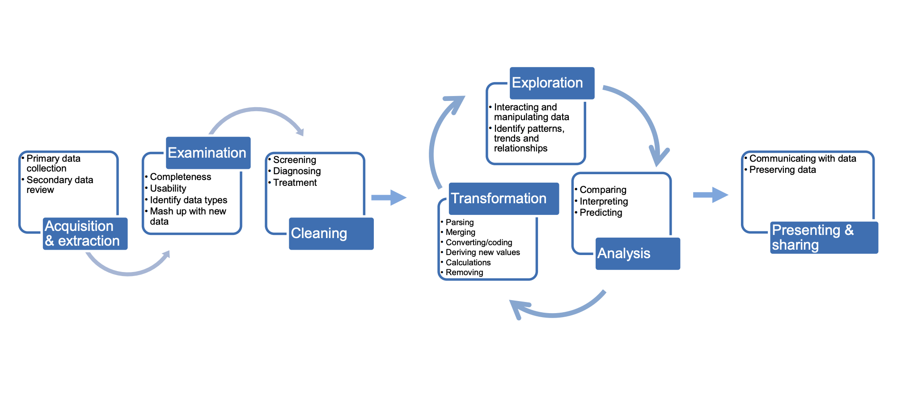
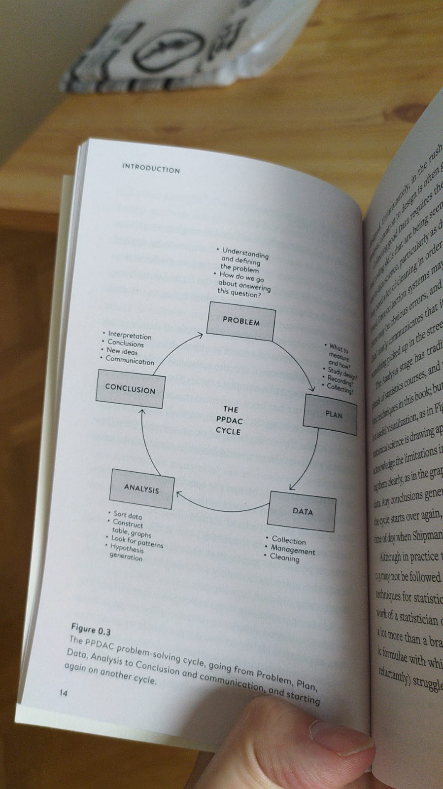

If there is a way to describe data analysis workflow in a diagram, this would be it:

This fits within a broader **PPDAC cycle**:
1. **Problem**: Identify the issue or question you want to address. Define the objectives of your study.
2. **Plan**: Decide on how to approach the problem, what data is needed, how to collect it, and what techniques to use for the analysis.
3. **Data**: Collect the data according to your plan. This may involve conducting surveys, experiments, observations, or pulling from existing databases.
4. **Analysis**: Analyze the collected data. This often involves statistical techniques to summarise data, identify patterns, make comparisons, and draw inferences.
5. **Conclusion**: Interpret your analysis in the context of the original problem. Make conclusions or predictions based on your results, and consider if your findings answer your initial question.

But one can also think about it as this double-diamond from [here](https://nightingaledvs.com/embrace-the-challenge-to-beat-imposter-syndrome/).

![[data-analysis-double-diamond.png]]