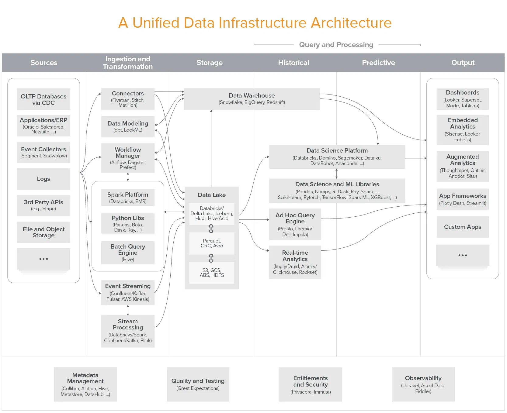

**Data infra:**
- enables data-driven decision making (analytic systems)
- and drive data-powered products, including with machine learning (operational systems).

Data infrastructure is undergoing rapid, fundamental changes at an architectural level. Building out a modern data stack involves a diverse and ever-proliferating set of choices. And making the right choices is more important now than ever, as we continue to shift from software based purely on code to systems that combine code and data to deliver value. Effective data capabilities are now table stakes for companies across all sectors -- and winning at data can deliver durable competitive advantage.

**Trends:**
- on premise > cloud (snowflake, big query)
- better and more reliable data lakes (presto)
- ETL > ELT (dbt)
- workflow manager > dataflow automation (airflow)
- analysts > self-serve insights (superset)
- data security and privacy
- OLAP
- matura data science (pandas, numpy)
- operational ML/AI

