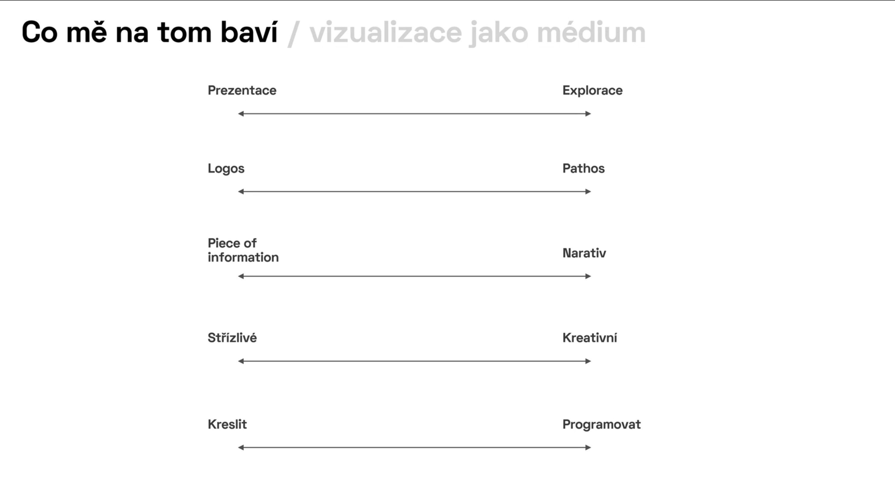

Andy Kirk defines *four stages of data visualization*:
1. Formulating your brief
2. Working with data
3. Establishing your editorial thinking
4. Developing your design solution

But you you can think about visualisation as balancing several axes:
