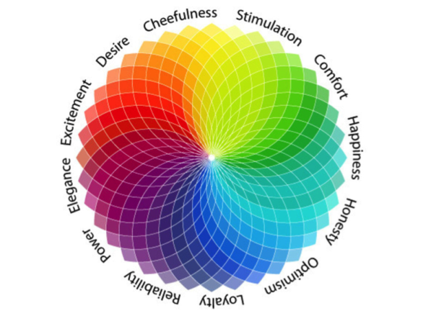
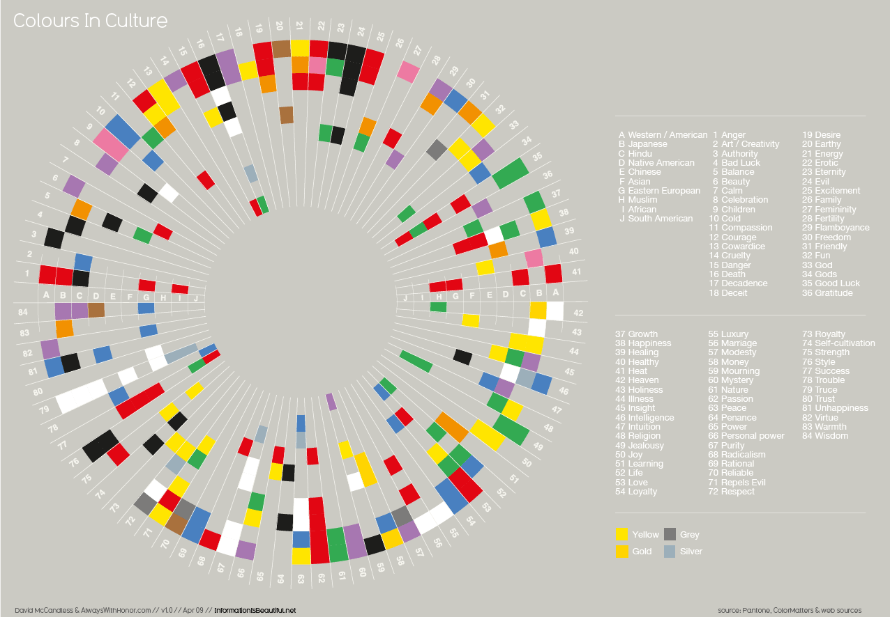
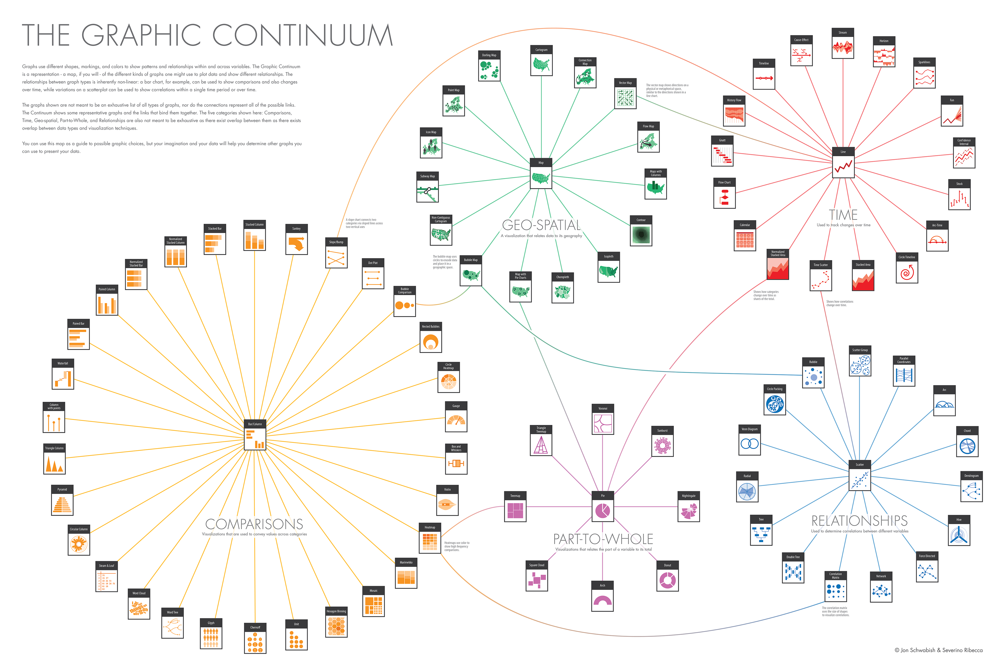
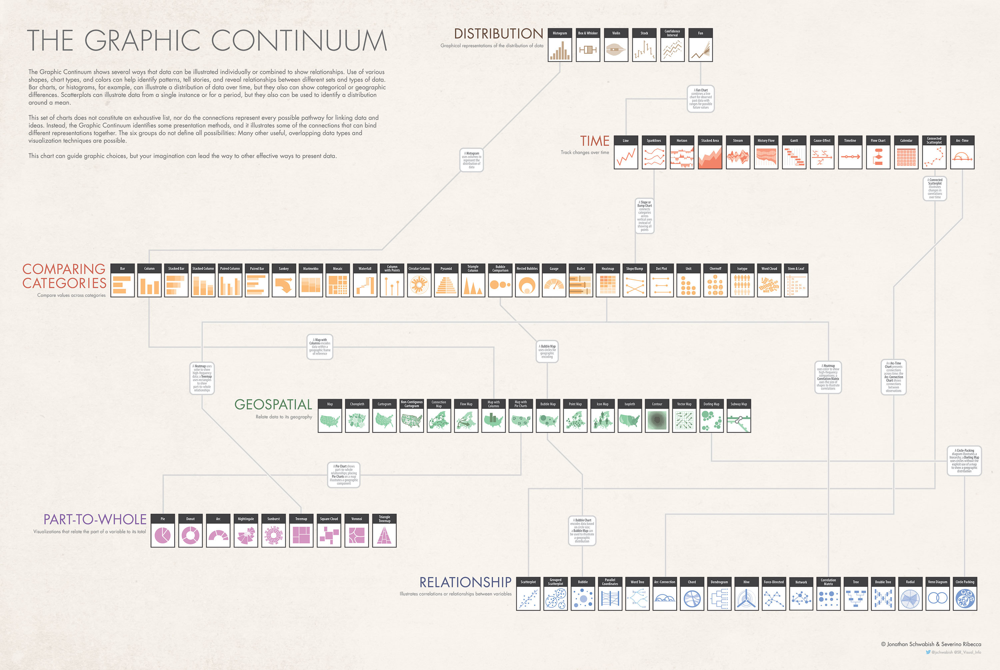

# Tips for Data Visualisations

Data Tools

*   JavaScript + D3
    *   CSS + HTML: [https://www.udemy.com/build-website-scratch/](https://www.udemy.com/build-website-scratch/)
    *   [https://www.udemy.com/masteringd3js/](https://www.udemy.com/masteringd3js/)
    *   [https://www.udemy.com/modern-javascript-from-the-beginning/](https://www.udemy.com/modern-javascript-from-the-beginning/) or [https://www.udemy.com/the-complete-javascript-course/](https://www.udemy.com/the-complete-javascript-course/)
    *   [https://www.udemy.com/svg-animation/](https://www.udemy.com/svg-animation/)
    *   [https://www.quora.com/How-do-I-learn-D3-js-What-is-its-background-What-is-it-How-does-it-work-Do-you-need-any-software-What-are-the-best-resources-to-learn](https://www.quora.com/How-do-I-learn-D3-js-What-is-its-background-What-is-it-How-does-it-work-Do-you-need-any-software-What-are-the-best-resources-to-learn)
    *   [https://d3js.org/](https://d3js.org/)
*   R Shiny Dashboards

General Tips

*   Albert Einstein: “Everything should be made as simple as possible, but not simpler.”
*   It depends whether operational overview or having a strong message
*   "It depends" idea -- consider purpose, audience, chart, LoD
*   Using Tableau for data mining and storytelling
*   Design it the way it is natural for the user > "they are a king"
*   Don't make it too cluttered > enough space around vizes > "data-ink ratio"
*   Only data should be seen
*   Always make sure the data are correct before sending them out
*   Use colour for the context > strap it and build back
*   making numbers human through scaling and comparisons
*   visuals should be rewarding = you should learn something
*   visuals should be simple to understand and pleasing
*   Headline should be a story, subheadline could a description
*   Uncover users' needs: Situation Problem Implication Need > tell me what I don't know

Notes

*   Tableau has its own engine -- stands alone for quick data exploration, but Power BI and Qlick use D3, so they are limited to reporting for which it was meant > you cannot find things that you don't know
*   Cord Chart
    *   [http://www.datablick.com/blog/2015/08/27/diy-chord-diagrams-in-tableau-by-noah-salvaterra](http://www.datablick.com/blog/2015/08/27/diy-chord-diagrams-in-tableau-by-noah-salvaterra)
*   How to save up some space in dashboards?

[[Tiny Tableau Talk May 2018 - Saving space in dashb.twbx | Tiny Tableau Talk May 2018 - Saving space in dashb.twbx]]

*   How to do chart with spikes around the clock = radial bar chart?
    *   [https://www.youtube.com/watch?v=d6-aptKLvgg&index=17&list=PLE50-dh6JzC450Hn6EjPM238yZUPs-RQ1](https://www.youtube.com/watch?v=d6-aptKLvgg&index=17&list=PLE50-dh6JzC450Hn6EjPM238yZUPs-RQ1)

[[London Cycle Hire Usage (MakeoverMonday W26).twbx | London Cycle Hire Usage (MakeoverMonday W26).twbx]]

*   How to do a donut chart + comparison of two bar charts by "needle"?

[[Australian Wage Gap.twbx | Australian Wage Gap.twbx]]

*   How to create "density"?
    *   Just put there large circles and give small opacity.
*   Cool way to do a zig zag chart.
    *   [https://public.tableau.com/en-us/s/gallery/european-football-club-rankings](https://public.tableau.com/en-us/s/gallery/european-football-club-rankings)
*   Need to sort?
    *   Use parameter to choose the correct dimension and then put it into the table, sort A-Z, but hide it.
*   Photos to Rows
    *   Create own palette with matching names and then use it

Documents

[[Viz-Tips.pdf | Viz Tips.pdf]]

[http://ft-interactive.github.io/visual-vocabulary/](http://ft-interactive.github.io/visual-vocabulary/)
[https://github.com/ft-interactive/chart-doctor/tree/master/visual-vocabulary](https://github.com/ft-interactive/chart-doctor/tree/master/visual-vocabulary)
[https://policyviz.com/2014/09/09/graphic-continuum/](https://policyviz.com/2014/09/09/graphic-continuum/)
[https://www.vizwiz.com/2018/07/visual-vocabulary.html](https://www.vizwiz.com/2018/07/visual-vocabulary.html)

[[data-viz-links.pdf | Data Viz Links.pdf]]

* Could be bought as a poster [here](https://policyviz.com/product/graphic-continuum-poster/)

---

    Created: 2018-05-16T14:52:08+02:00
    Updated: 2019-07-07T18:21:30+02:00
    Source:  http://www.makeovermonday.co.uk/week-32-2018/
